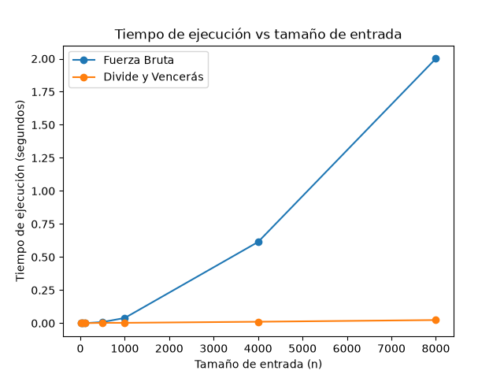

# Curso análisis de algoritmos 
## Estudiante: Carolina Uribe Builes


## Propósito carpetas y archivos  

* medicion.py: Toma de tiempos de ejecución de Fuerza Bruta y Subarreglo Máximo y generación de gráficas en base a la comparación de estos resultados.
* pruebas.py: Lógica para probar el funcionamiento de los métodos definidos en subarreglo.py por medio de diferentes casos.
* subarreglo.py: Implementación de los algoritmos de Fuerza Bruta y Subarreglo Máximo
* graficas/: Carpeta que almacena las gráficas generadas en el laboratorio.

## Instrucciones para reproducir el laboratorio 
> Las siguientes instrucciones permiten configurar el entorno y ejecutar el laboratorio en Windows, macOS y Linux.

### Windows

Para reproducir el entorno y ejecutar los experimentos en Windows, siga los siguientes pasos:

1. Abra una terminal dentro de la carpeta nombrada `lab2-divide-y-venceras`.

2. Cree el entorno virtual:

```bash
python -m venv venv
```

3. Active el entorno virtual:

```bash
venv\Scripts\activate
```

4. Instale las dependencias contenidas en el archivo `requirements.txt`:

```bash
python -m pip install -r requirements.txt
```

5. Ejecute el archivo `pruebas.py` para verificar el funcionamiento de los métodos:

```bash
python pruebas.py
```

6. Ejecute el archivo `medicion.py` para realizar las mediciones de tiempo y generar la gráfica:

```bash
python medicion.py
```

### macOS

Para reproducir el entorno y ejecutar los experimentos en macOS, siga los siguientes pasos:

1. Abra una terminal dentro de la carpeta nombrada `lab2-divide-y-venceras`.

2. Cree el entorno virtual:

```bash
python3 -m venv venv
```

3. Active el entorno virtual:

```bash
source venv/bin/activate
```

4. Instale las dependencias contenidas en el archivo `requirements.txt`:

```bash
python3 -m pip install -r requirements.txt
```

5. Ejecute el archivo `pruebas.py` para verificar el funcionamiento de los métodos:

```bash
python3 pruebas.py
```

6. Ejecute el archivo `medicion.py` para realizar las mediciones de tiempo y generar la gráfica:

```bash
python3 medicion.py
```

### Linux

Para reproducir el entorno y ejecutar los experimentos en Linux, siga los siguientes pasos:

1. Abra una terminal dentro de la carpeta nombrada `lab2-divide-y-venceras`.

2. Cree el entorno virtual:

```bash
python3 -m venv venv
```

3. Active el entorno virtual:

```bash
source venv/bin/activate
```

4. Instale las dependencias contenidas en el archivo `requirements.txt`:

```bash
python3 -m pip install -r requirements.txt
```

5. Ejecute el archivo `pruebas.py` para verificar el funcionamiento de los métodos:

```bash
python3 pruebas.py
```

6. Ejecute el archivo `medicion.py` para realizar las mediciones de tiempo y generar la gráfica:

```bash
python3 medicion.py
```

La gráfica generada se almacenará en la carpeta **`graficas/`**.

## Parte 1 - Verificación de soluciones y casos cubiertos
> Acceda al código de [subarreglo.py](./subarreglo.py) y [pruebas.py](./pruebas.py)

Para verificar las soluciones obtenidas por ambos métodos se resolvió cada serie calculando manualmente la suma máxima esperada, simulando el funcionamiento del método de fuerza bruta y de divide y vencerás. Lo anterior fue fundamental para poder determinar los valores esperados y así establecer si cada “assert” debía fallar o cumplirse.

Para este punto se decidió trabajar con los casos mínimos planteados por el maestro:
- Serie de ocho días de la situación problema: Se verificó que ambos algoritmos encontraran una suma máxima de `17`. Este caso permite comprobar el funcionamiento general de las dos soluciones sobre el ejemplo planteado en el laboratorio.
- Serie de un solo elemento: Se utilizó la serie `[6]`, cuyo resultado esperado es `6`. Este caso permite comprobar el caso base del algoritmo de Divide y Vencerás, en el que el rango considerado contiene un único elemento.
- Serie con todos los valores negativos: Se utilizó una serie en la que todos los valores son negativos. El resultado esperado es `-2`, que corresponde al elemento menos negativo de la serie. Con este caso se logra verificar que los algoritmos no seleccionen una suma de cero ni descarten todos los elementos cuando no existen valores positivos.
- Serie con todos los valores positivos: Se utilizó una serie cuya suma total es `40`. En este caso, el mejor tramo corresponde a todos los elementos, por lo que se comprueba que los algoritmos puedan acumular correctamente toda la ganancia disponible.
- Caso donde la mejor racha cruza el punto medio: Se utilizó la serie `[-10, 4, 5, 6, 7, -10]`, cuyo mejor tramo tiene una suma de `22`. Este caso es importante para Divide y Vencerás, porque permite comprobar que la solución no se limite al mejor tramo de la mitad izquierda o de la mitad derecha, sino que también considere el tramo que cruza el punto medio.
- 20 listas aleatorias: Se generaron 20 listas de longitud aleatoria, con valores entre `-10` y `10`. Como en este caso no se conoce la suma máxima de cada una, se utilizó el resultado de Fuerza Bruta como referencia y se verificó que Divide y Vencerás obtuviera la misma suma, lo que permitió comprobar la coincidencia entre ambos algoritmos en diferentes combinaciones de valores y tamaños. 

En todas las pruebas se comparó únicamente la suma máxima (`[2]`) de las tuplas retornadas por los algoritmos y no los índices inicial y final, para ser consistente con el requisito de que pueden existir diferentes tramos con la misma suma máxima. 

## Parte 2 - Gráfica y medición
> Acceda al código de [medicion.py](./medicion.py)



Para comparar el comportamiento de los algoritmos se utilizaron siete tamaños de entrada: `10`, `50`, `100`, `500`, `1000`, `4000` y `8000`, con el propósito de observar su comportamiento desde entradas pequeñas hasta tamaños suficientemente grandes para evidenciar diferencias en los tiempos de ejecución. Para cada tamaño se generó una única lista con valores enteros entre `-100` y `100`, utilizando la semilla fija `42`, y esta misma lista fue utilizada por los dos algoritmos, de manera que ambos se ejecutaran sobre exactamente los mismos datos y la comparación de sus tiempos no dependiera de recibir entradas diferentes.

El tiempo de ejecución se midió utilizando time.perf_counter(), iniciando el cronómetro inmediatamente antes de llamar a cada algoritmo y deteniéndolo justo después de que terminara, por lo que la generación de los datos no hace parte del tiempo medido. Además, para cada tamaño se verificó mediante un assert que los dos algoritmos obtuvieran la misma suma máxima, con el fin de comprobar durante el laboratorio que ambos estuvieran resolviendo el mismo problema y que la comparación de los tiempos se realizara sobre los mismos resultados. 

No se repitió cada medición varias veces ni se calcularon promedios. El programa sí fue ejecutado varias veces durante la elaboración del laboratorio para comprobar que la generación de las series, la ejecución de los algoritmos, la validación de sus resultados y la generación de la gráfica funcionaran correctamente.

Resultados obtenidos tras la ejecución del código de medición:
|   n  | Fuerza Bruta (s) | Divide y Vencerás (s) |
|:----:|:----------------:|:---------------------:|
|  10  |     0.000012     |        0.000034       |
|  50  |     0.000087     |        0.000226       |
|  100 |     0.000275     |        0.000235       |
|  500 |     0.010274     |        0.001105       |
| 1000 |     0.058556     |        0.003483       |
| 4000 |     0.851123     |        0.010772       |
| 8000 |     2.209032     |        0.022011       |

## Parte 3 - Respuestas análisis
1. Recurrencia:

La función `subarreglo_maximo` divide el arreglo en dos mitades y resuelve cada una de ellas de forma recursiva, generando así dos subproblemas de tamaño aproximadamente n/2. A continuación, calcula la mejor suma que pasa por el punto medio recorriendo los elementos de ambos lados, lo que tiene una complejidad temporal de Θ(n). Por lo tanto, la relación de recurrencia es: T(n) = 2T(n/2) + Θ(n).

Aplicando el método maestro se tiene a = 2, b = 2 y f(n) = Θ(n). Dado que n^(log_2(2)) = n y f(n) pertenece a Θ(n), esto se corresponde con el caso 2 del método maestro. Por lo tanto, T(n) = Θ(n log n). En cambio, la función de fuerza bruta hace uso de dos ciclos para considerar los diferentes inicios y finales posibles del subarreglo, por lo que el número de combinaciones crece proporcionalmente a n² y su complejidad es Θ(n²).

2. Lo medido contra lo esperado:

En la gráfica se puede observar que Fuerza Bruta aumenta mucho más rápido que Divide y Vencerás a medida que crece n. Por ejemplo, entre 4000 y 8000, el tiempo de Fuerza Bruta pasó de 0.851 segundos a 2.209 segundos, aumentando unas 2.60 veces, mientras que Divide y Vencerás pasó de 0.0108 segundos a 0.0220 segundos, aumentando unas 2.04 veces. Para Θ(n²) se esperaba un aumento cercano a 4 veces al duplicar n, mientras que para Θ(n log n) se esperaba un aumento un poco mayor a 2 veces, aproximadamente 2.2. Los resultados de Divide y Vencerás coinciden con lo que se esperaba, mientras que Fuerza Bruta creció menos de lo proyectado, lo que puede deberse a factores propios de la ejecución como la caché, aunque la tendencia se mantiene.

3. Tamaños pequeños:

Las mediciones muestran efectivamente un punto a partir del cual el algoritmo de Divide y Vencerás empieza a ser más rápido. Para valores de n = 10 y n = 50, Fuerza Bruta fue más rápido (en n = 50, 0.000087 s contra 0.000226 s), pero con n = 100 Divide y Vencerás ya lo supera (0.000235 s contra 0.000275 s). Una de las razones de ello es que, con entradas muy pequeñas, el costo adicional de realizar las llamadas recursivas hace que la ventaja de su menor complejidad todavía no sea suficiente para compensarlo. 

4. ¿Cuándo conviene dividir?:

Si el objetivo fuese solo encontrar el valor máximo de un arreglo, dividirlo no generaría una mejora asintótica respecto a recorrerlo una sola vez. Al dividir el arreglo se tendrían dos subproblemas de tamaño n/2 y para combinar sus resultados solo sería necesario comparar los dos máximos, con un costo de Θ(1). La recurrencia sería T(n) = 2T(n/2) + Θ(1), que se resuelve como Θ(n), similar al costo de hacer un recorrido directo, por lo que en este caso sería más fácil recorrer el arreglo una sola vez. 

5. Concepto para la gerente:

Para la cooperativa, la recomendación sería implementar el algoritmo de Divide y Vencerás, ya que su tasa de crecimiento Θ(n log n) es mucho menor que la de Fuerza Bruta, que es Θ(n²). Tomando como base la medición con n = 8000 (2.2 segundos para Fuerza Bruta y 0.02 segundos para Divide y Vencerás), al escalar teóricamente a 1.000.000 registros se obtiene que Fuerza Bruta escala con un factor de (1.000.000/8000)² = 15.624, tomando aproximadamente 9.5 horas; mientras que Divide y Vencerás escala según la razón n log n con un factor aproximado de 192.2, culminando en aproximadamente 3.84 segundos. 

Lo anterior es una estimación ya que el tiempo real depende de las especificaciones que se posean en cuanto a hardware, el uso de la memoria caché y de la sobrecarga que tenga el entorno en el que se esté realizando la ejecución. 
